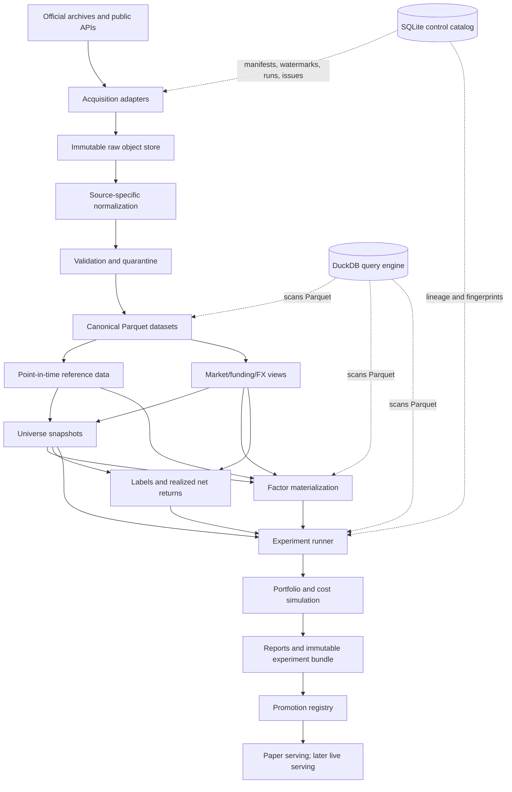

# 00 — System Architecture

## 1. Objective

Build a research and eventual paper/live trading platform that can answer one question reliably:

> At decision time `t`, using only information available by `t`, which eligible assets have the highest expected **net** returns over the declared horizon?

The system is optimized for correctness and reproducibility on one six-core/twelve-thread CPU with 32 GB of RAM. It is not optimized for high-frequency trading, sub-second latency, or distributed model training.

No architecture can guarantee that every first decision is perfect. The correct goal is to make foundational decisions **simple, testable, and reversible without corrupting research lineage**.

## 2. Architecture style: modular monolith

Use one repository and one installable Python package with strict domain boundaries. Components communicate through typed functions, immutable datasets, manifests, and explicit run records—not through network services.

### Why this is the correct fit

- The primary U50 daily/weekly panel is small.
- Historical 5-minute data can be queried out-of-core from Parquet.
- A distributed system would add operational failure modes without solving a real scale problem.
- Research/serving parity is easier when both use the same library functions.
- One writer and many local readers are sufficient.

### Explicitly rejected for v1

- Spark or Dask clusters
- Kafka or another message bus
- Airflow/Prefect/Dagster server
- PostgreSQL/Timescale as the primary observation store
- object-storage lakehouse formats such as Delta/Iceberg
- MLflow tracking server
- dedicated feature-store product
- Kubernetes or microservices
- a vector database
- GPU-specific frameworks

These may be reconsidered only after measured constraints—not anticipated scale—justify them.

## 3. Logical component map

## 4. Physical architecture

### Data plane

- Filesystem directories for raw, canonical, derived, and experiment data.
- Parquet for tabular observations.
- Compressed original bytes (`.zip`, `.csv.gz`, `.json.zst`, `.ndjson.zst`) for raw source objects.
- DuckDB for SQL scans, joins, validation queries, and report extracts.
- Polars/PyArrow for source parsing, streaming transformations, and deterministic Parquet writing.

### Control plane

A small SQLite database stores:

- source definitions;
- raw object registrations;
- dataset manifests and dependencies;
- schemas and transform versions;
- ingestion watermarks;
- build/run status;
- quality issues and quarantines;
- experiment fingerprints;
- artifact registrations;
- model promotion state.

The SQLite catalog does **not** store large price/funding/factor tables.

### Repository plane

Git stores:

- code;
- schemas;
- research registrations;
- factor definitions;
- configurations;
- SQL templates;
- tests;
- small synthetic/golden fixtures;
- dataset manifests without proprietary/raw observations;
- experiment summaries that are safe to publish.

Raw observations and large artifacts remain outside Git.

## 5. Domain boundaries

### `catalog`

Dataset identity, lineage, schemas, watermarks, runs, and quality issues.

### `ingest`

Venue/provider-specific discovery and acquisition. It preserves original bytes before parsing.

### `reference`

Assets, instruments, aliases, venues, listings, delistings, migrations, contracts, fee schedules, and source reliability.

### `quality`

Schema checks, temporal checks, gaps, duplicates, unit checks, cross-source comparisons, quarantine decisions.

### `market`

Canonical bars, trades where needed, funding cash flows, mark/index prices, stablecoin FX, and execution-route snapshots.

### `universe`

Point-in-time U25/U50/U100 membership and shortability snapshots with rejection reasons.

### `factors`

Pure, versioned factor functions. They consume point-in-time inputs and output raw values, transformed scores, missing reasons, and lineage.

### `labels`

Forward gross/net returns and event intervals. Labels never enter feature datasets.

### `validation`

Chronological folds, event-time purging, embargoes, block bootstrap, clustered inference, and multiple-testing controls.

### `portfolio`

Signal-to-weight functions, capacity limits, cost models, funding/borrow, accounting, and benchmarks.

### `experiments`

Frozen configs, fingerprints, execution, metrics, artifacts, and append-only decisions.

### `serving`

Loads only promoted research versions; recomputes the same approved features; fails closed on stale, missing, or incompatible inputs.

## 6. Batch pipeline

Each published dataset follows the same state machine:

1. **Discover** source objects or API ranges.
2. **Acquire** exact bytes into a temporary file.
3. **Verify** transport checksum when the source provides one.
4. **Hash** bytes locally and atomically move to content-addressed raw storage.
5. **Register** raw object and request metadata in SQLite.
6. **Normalize** into a source-specific typed table.
7. **Validate** schema, timestamp, units, duplicates, and coverage.
8. **Quarantine** failed partitions; never silently repair them.
9. **Canonicalize** accepted rows with stable identifiers and UTC semantics.
10. **Publish** immutable Parquet files plus a manifest.
11. **Build** downstream datasets only from manifest IDs.

No collector writes directly into a canonical dataset.

## 7. Research execution

An experiment bundle is the atomic research result. It contains:

- preregistered experiment ID;
- canonical config;
- Git commit;
- dependency lock hash;
- dataset and universe IDs;
- factor/model versions;
- split definitions and event intervals;
- all predictions/scores, including no-trade/flat outputs;
- gross and net portfolio paths;
- cost/funding attribution;
- metrics and inference;
- logs and environment details;
- decision: reject, advance, archive, or pending.

A run fingerprint is the SHA-256 of the canonicalized bundle inputs. The same fingerprint cannot be silently overwritten.

## 8. Serving architecture

Serving is not a separate model implementation. It is a thin adapter around promoted research code.

### Phase 1 serving

- Once-daily or once-weekly batch job.
- Pull latest closed bars/funding and metadata.
- Validate freshness and completeness.
- Materialize approved universe and factors.
- Generate target weights.
- Persist a signed decision snapshot.
- Send to paper simulator only.

### Fail-closed conditions

- missing required source partition;
- stale clock or data;
- unknown instrument mapping;
- universe build failure;
- factor/model version mismatch;
- representation mismatch;
- absent cost/shortability information;
- checksum or schema mismatch.

### Information bars

The architecture reserves an `event_bar` domain, but it remains disabled. A model manifest must declare representation type/version and causal threshold history. Filename suffixes are never used as compatibility controls.

## 9. Observability

Use structured JSON logs and small run-status tables, not a monitoring stack.

Every job records:

- run ID and command;
- start/end time;
- code/config hashes;
- source requests;
- rows/bytes read and written;
- memory/CPU elapsed where available;
- validation counts;
- published dataset ID;
- failure class and retryability.

Daily health output can be rendered as one static HTML/Markdown report.

## 10. Architecture acceptance gates

The platform is not ready for factor research until it proves:

- raw objects cannot be overwritten;
- append/re-download produces deterministic hashes;
- all source timestamps normalize correctly, including source unit changes;
- no as-of query returns a value with `availability_time > decision_time`;
- current symbol metadata cannot alter historical universe snapshots;
- ticker aliases cannot collide silently;
- missing is distinct from zero;
- feature and label datasets cannot be joined without an explicit event-time operation;
- changing any dataset/config/code dependency changes the experiment fingerprint;
- quarantined partitions are excluded and visible;
- a small synthetic end-to-end run reproduces byte-for-byte or within declared floating tolerances.
